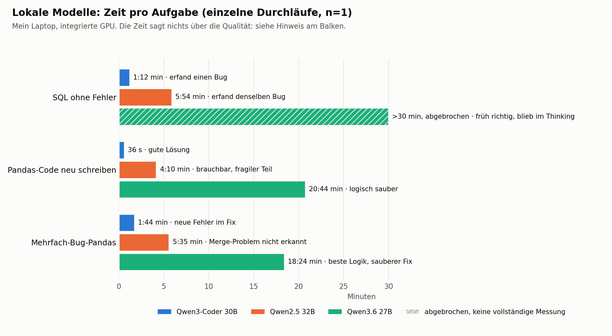

# Lokale KI-Modelle: Tests, Zeiten und Ergebnisse

**Zurück zur Übersicht:** [Wie ich lokale und Cloud-KI tatsächlich benutze](LOCAL_AI_WORKFLOW_README_DE.md) · **English:** [MODEL_TESTS.md](MODEL_TESTS.md)

> **Persönlicher Praxisbericht – kein allgemeiner KI-Benchmark**
> Stand der Tests: September 2026

Die Übersicht beschreibt, wie ich mit KI an meinen Projekten arbeite. Diese Datei enthält den technischen Teil dazu: Welche lokalen Sprachmodelle ich mit Ollama getestet habe, mit welchen Aufgaben, wie lange sie gebraucht haben, welche Fehler sie gemacht haben und welches Modell ich heute wofür nehme.

Die Ergebnisse gelten für **meinen Rechner, meine Modelle und meine Einstellungen**. Ich habe kein professionelles KI-Benchmarking gemacht. Ich wollte Zahlen haben, um Entscheidungen zu treffen.

---

## Inhaltsverzeichnis

- [1. Mein System](#1-mein-system)
- [2. Erst musste die Umgebung stimmen](#2-erst-musste-die-umgebung-stimmen)
- [3. Ollama direkt statt Open WebUI](#3-ollama-direkt-statt-open-webui)
- [4. Warum lokale KI, und warum nicht nur lokale KI](#4-warum-lokale-ki-und-warum-nicht-nur-lokale-ki)
- [5. Wie ich getestet habe](#5-wie-ich-getestet-habe)
- [6. Test: Die Abfrage ohne Fehler](#6-test-die-abfrage-ohne-fehler)
- [7. Test: Many-to-Many Merge](#7-test-many-to-many-merge)
- [8. Die gemessenen Zeiten](#8-die-gemessenen-zeiten)
- [9. Die getesteten Modelle](#9-die-getesteten-modelle)
- [10. Welches Modell ich wofür nehme](#10-welches-modell-ich-wofür-nehme)
- [11. Was ich aus dem Vergleich gelernt habe](#11-was-ich-aus-dem-vergleich-gelernt-habe)
- [12. Ein guter Prüfauftrag für ein Modell](#12-ein-guter-prüfauftrag-für-ein-modell)
- [13. Mein lokaler Data-Analysis-Workflow](#13-mein-lokaler-data-analysis-workflow)
- [14. Ein paar einfache Ollama-Befehle](#14-ein-paar-einfache-ollama-befehle)

---

## 1. Mein System

| Komponente | Mein System |
|---|---|
| Betriebssystem | EndeavourOS / Arch Linux |
| CPU | AMD Ryzen AI 9 HX 370, 12 Kerne / 24 Threads |
| RAM | ca. 93 GiB nutzbar |
| GPU | integrierte AMD Radeon 890M (`gfx1150`) |
| GPU-Speicher | Shared Memory |
| NVIDIA | keine |
| Ollama | lokale Modell-Ausführung |
| Docker | für weitere lokale Dienste |
| Oberfläche | Terminal direkt über Ollama; Open WebUI zusätzlich getestet |

Der Laptop hat keine eigene Grafikkarte. Ein Modell, das bei mir 20 Minuten braucht, kann auf einer starken dedizierten GPU ganz anders laufen. Wenn hier steht „Modell X ist langsam", bedeutet das immer:

> **Modell X war bei dieser Aufgabe auf meinem System und mit meiner Konfiguration langsam.**

---

## 2. Erst musste die Umgebung stimmen

Ein Teil der Arbeit betraf nicht die Modelle, sondern die Umgebung.

**GPU.** Meine integrierte AMD-GPU wurde anfangs von Ollama nicht sinnvoll verwendet. Nach Aktivierung der iGPU-Nutzung konnte ich mit `ollama ps` sehen, dass die Modelle tatsächlich auf der GPU lagen. Ohne diese Kontrolle vergleicht man am Ende unterschiedliche Hardware-Pfade und nicht die Modelle.

**Kontext.** Bei einem Modell zeigte Open WebUI einen Kontext von `32768`, obwohl ich mit kleineren Einstellungen arbeiten wollte. Eine direkte Anfrage an Ollama mit `num_ctx=8192` wurde dagegen korrekt mit 8192 ausgeführt.

Das war einer der Gründe, warum ich die Vergleichstests später **direkt im Terminal** gemacht habe.

---

## 3. Ollama direkt statt Open WebUI

Zuerst habe ich viel über Open WebUI getestet. Manche großen Modelle wirkten dort fast unbrauchbar langsam: mehrere Minuten, teilweise Timeouts.

Dann habe ich dieselben Modelle direkt gestartet:

```bash
ollama run MODELNAME
```

Das Bild war teilweise komplett anders. Einige Modelle begannen sofort zu antworten und schrieben Wort für Wort. Ich sehe dann gleich, dass etwas passiert.

Das heißt **nicht**, dass Open WebUI schlecht ist. Mögliche Gründe für den Unterschied:

- längere System-Prompts,
- Chat-History,
- Tools / Function Calling,
- zusätzliche Kontextdaten,
- eine größere Context-Window-Einstellung,
- meine eigene Konfiguration,
- Dinge, die ich in Open WebUI noch nicht optimal eingestellt habe.

Ich mache daraus keine allgemeine Behauptung. Für **meine aktuelle Arbeitsweise** ist die direkte Nutzung einfacher, transparenter und schneller. Open WebUI kann sinnvoll bleiben, wenn ich Dateien, RAG, Tools oder eine komfortable Oberfläche brauche. Für reine Modelltests will ich möglichst wenige Schichten zwischen Prompt und Modell.

---

## 4. Warum lokale KI, und warum nicht nur lokale KI

### Datenschutz und Gewohnheit

Nicht jede Datei ist streng geheim. Trotzdem will ich nicht automatisch alles an einen externen Dienst schicken.

> Wenn es lokal bleiben kann, warum soll es überhaupt meinen Rechner verlassen?

Es geht dabei auch um Gewohnheit und Datenminimierung, nicht nur um „hoch sensibel" oder „nicht sensibel".

**Lokal bedeutet nicht automatisch erlaubt.** In einer Firma entscheiden die internen Regeln für IT, Datenschutz und Compliance. Wenn Cloud-KI verboten ist, ist deshalb nicht jedes lokale Modell erlaubt. Ich will aber technisch in der Lage sein, auch ohne Cloud-KI sinnvoll zu arbeiten.

### Kosten und Limits

Lange Arbeitssitzungen erzeugen sehr viele Nachrichten: eine SQL-Abfrage, ein Fehler, eine neue Version, eine neue Fehlermeldung, Daten prüfen, Text korrigieren, Diagramm ändern, noch einmal prüfen, README überarbeiten, zurück zum Code.

Wenn jede kleine Frage in die Cloud geht, ist ein Nutzungs- oder API-Limit schnell unnötig belastet. Eine kleine Syntaxfrage oder eine normale E-Mail muss nicht die stärkste Cloud-KI verbrauchen. Lokale KI ist deshalb auch eine **Entlastung für die Cloud**.

### Unabhängigkeit

Es gibt Umgebungen, in denen externe KI nicht genutzt werden darf oder zeitweise nicht verfügbar ist. Mein Workflow soll nicht zusammenbrechen, sobald ChatGPT oder ein anderer Cloud-Dienst fehlt. Lokale Modelle müssen nicht alles können. Sie müssen genug können, damit ich weiterarbeiten kann.

### Wofür Cloud-KI wichtig bleibt

- komplexe Aufgaben mit vielen Schritten,
- starke zweite oder dritte Kontrolle,
- aktuelle Recherche im Web,
- Arbeiten mit vielen Dateien,
- umfangreiche Formatierung,
- fertige Dokumente und Artefakte,
- schwierige methodische Diskussionen,
- längere Projektplanung,
- Fälle, in denen lokale Modelle qualitativ nicht reichen.

Mein Ziel ist kein **Local-only-System**, sondern:

> **Benutze lokal, was lokal gut funktioniert. Benutze Cloud dort, wo die zusätzliche Qualität oder Funktion wirklich etwas bringt.**

### Was lokale KI nicht ersetzt

Dokumentation, Quellenkritik, eigene Plausibilitätsprüfung, Web-Recherche, menschliches Urteil, Datenschutzregeln eines Arbeitgebers, fachliche Verantwortung und starke Cloud-Modelle bei wirklich schwierigen Aufgaben.

Lokale KI ist eine zusätzliche Schicht in meinem Werkzeugkasten. Nicht mehr und nicht weniger.

---

## 5. Wie ich getestet habe

Ich wollte keine Online-Rankings übernehmen. Ein Modell kann in einem Benchmark sehr gut sein und für meine Arbeit trotzdem nervig. Deshalb habe ich Aufgaben genommen, die ich wirklich brauche.

### Sprach- und Alltagstests

- kurze professionelle E-Mail auf Deutsch,
- fehlerhaften englischen Text natürlich korrigieren,
- eine API in einfachem Deutsch erklären,
- vier kurze Bullet Points zusammenfassen,
- auf normales Alltagsenglisch reagieren, ohne wie ein Lehrer zu klingen.

### Analyse-Test

Ich gab zwei hypothetische DeFi-Lending-Protokolle vor, mit unterschiedlichem Borrow Volume, unterschiedlicher Zahl von Borrowern, unterschiedlichen Positionsgrößen, Liquidationsvolumen und Borrower Concentration.

Das Modell sollte:

- Beobachtung und Interpretation trennen,
- alternative Erklärungen nennen,
- zusätzliche Metriken vorschlagen,
- problematische Kennzahlen erkennen,
- keine Kausalität erfinden.

### Coding- und Debugging-Tests

1. **Pandas Duplicate Weighting**
   Ein `transform("sum")` erzeugt Borrower-Gesamtsummen auf mehreren Transaktionszeilen. Danach wird fälschlich der Mittelwert dieser wiederholten Werte berechnet.

2. **Many-to-Many Merge / Double Counting**
   Mehrere Borrow-Zeilen und mehrere Liquidation-Zeilen desselben Borrowers werden direkt gemerged. Dadurch entsteht ein kartesisches Produkt.

3. **SQL ohne Fehler**
   Eine Query war bewusst korrekt. Das Modell sollte nur einen Fehler melden, wenn wirklich einer vorhanden war.

4. **Code selbst schreiben**
   Das Modell sollte aus einer einfachen DataFrame-Struktur korrekte Monatsmetriken inklusive Top-10-Borrower-Share bauen.

5. **Mehrere Bugs gleichzeitig**
   Ein Test kombinierte Merge Explosion, falsches `count`, falsche Durchschnittsebene und Liquidationsvolumen.

Die Aufgabe ohne Fehler war besonders hilfreich. Sie zeigte, dass Modelle nicht nur echte Fehler übersehen, sondern auch Fehler erfinden.

---

## 6. Test: Die Abfrage ohne Fehler

Die SQL-Query aggregierte zuerst auf:

```text
month + protocol + borrower
```

Danach wurde gruppiert auf:

```text
month + protocol
```

Jede Zeile der CTE entspricht damit bereits genau einem eindeutigen Borrower im jeweiligen Monat und Protokoll. Deshalb war

```sql
COUNT(*)
```

vollkommen korrekt.

**Ergebnis:**

- `qwen3-coder:30b` und `qwen2.5:32b` behaupteten trotzdem, `COUNT(*)` sei falsch und müsse durch `COUNT(DISTINCT borrower)` ersetzt werden. Das neue SQL hätte in diesem Fall denselben Wert geliefert, aber die Begründung war falsch.
- `qwen3.6:27b` erkannte ziemlich früh, dass die Query korrekt war. Danach dachte es sehr lange weiter und prüfte dieselbe Sache immer wieder.

> Ein Modell kann einen „Fix" liefern, der das Ergebnis nicht kaputtmacht, und trotzdem die Logik falsch verstanden haben.

**Richtig liegen, aber 30 Minuten darüber nachdenken, ob etwas richtig ist, ist im Alltag auch nicht ideal.**

---

## 7. Test: Many-to-Many Merge

Das Beispiel:

- Borrower `0x1` hat zwei Borrow-Zeilen.
- Derselbe Borrower hat zwei Liquidation-Zeilen.

Ein direkter Merge auf

```python
["month", "protocol", "borrower"]
```

erzeugt:

```text
2 Borrows × 2 Liquidations = 4 Zeilen
```

Damit werden sowohl die Borrow-Werte als auch die Liquidation-Werte vervielfacht.

**Ergebnis:**

- `qwen3-coder:30b` erkannte den Merge-Fehler, schrieb danach aber einen unvollständigen Fix: Es aggregierte nur eine Seite korrekt und konnte dadurch wieder Werte vervielfachen.
- `qwen2.5:32b` übersah in einem späteren Mehrfach-Bug-Test den zentralen Merge-Fehler komplett.
- `qwen3.6:27b` erkannte den Many-to-Many-Join, die Inflation des Borrow Volume, die Inflation des Liquidation Volume, `count` statt `nunique` und die falsche Durchschnittsebene.

`qwen3.6:27b` schlug auch die saubere Lösung vor:

1. Borrows separat aggregieren.
2. Liquidations separat aggregieren.
3. Erst danach die aggregierten Tabellen verbinden.

Das war qualitativ die beste Antwort, aber deutlich langsamer.

---

## 8. Die gemessenen Zeiten

Diese Zeiten sind **keine standardisierten Benchmarks**. Es sind einzelne reale Durchläufe auf meinem System.

| Test | Modell | Einzelner Durchlauf (n=1) | Ergebnis |
|---|---|---:|---|
| SQL „kein Fehler vorhanden" | Qwen3-Coder 30B | ca. 1:12 min | schnell, aber erfand einen Bug |
| SQL „kein Fehler vorhanden" | Qwen2.5 32B | ca. 5:54 min | langsamer, erfand denselben Bug |
| SQL „kein Fehler vorhanden" | Qwen3.6 27B | >30 min, abgebrochen | erkannte früh, dass Query korrekt war, blieb aber im Thinking |
| Pandas-Code neu schreiben | Qwen3-Coder 30B | ca. 36 s | gute Lösung |
| Pandas-Code neu schreiben | Qwen2.5 32B | ca. 4:10 min | brauchbar, aber fragiler Teil |
| Pandas-Code neu schreiben | Qwen3.6 27B | ca. 20:44 min | logisch sauber, extrem langsam |
| Mehrfach-Bug-Pandas | Qwen3-Coder 30B | ca. 1:44 min | mehrere echte Punkte erkannt, aber neue Fehler im Fix |
| Mehrfach-Bug-Pandas | Qwen2.5 32B | ca. 5:35 min | zentrale Merge-Problematik nicht erkannt |
| Mehrfach-Bug-Pandas | Qwen3.6 27B | ca. 18:24 min | beste Logik und sauberer Fix |
| 4 Sprach-/Alltagsfragen | Mistral Small 3.1 | ca. 3:38 min gesamt | sprachlich sehr gut |



Das Diagramm zeigt die neun Durchläufe der drei Coding-Aufgaben. Der schraffierte Balken wurde nach 30 Minuten abgebrochen.

> **Geschwindigkeit, Modellgröße und Genauigkeit sind drei verschiedene Dinge.**

---

## 9. Die getesteten Modelle

### `mistral-small3.1`

**Getestet für:** deutsche E-Mail, Englischkorrektur, Alltagssprache, einfache technische Erklärung.

**Stärken:** natürliche Sprache, kontrollierte Korrekturen, freundlich ohne unnötig formell zu werden.

**Schwäche:** nicht das absolut schnellste kleine Modell auf meinem System.

**Rolle:** **Hauptkandidat für Alltag, Schreiben, Sprache und normale Gespräche.**

### `gemma2:9b-instruct`

**Stärken:** sehr schnell, gute kurze E-Mails, gute einfache Erklärungen, gutes natürliches Englisch.

**Schwächen:** bei Tools / Function Calling in Open WebUI gab es Probleme; verändert den Stil manchmal stärker als gewünscht.

**Rolle:** **Sehr schnelles Alltags- und Büromodell.**

### `qwen2.5:14b-instruct`

**Stärken:** schnell, sachlich, gute Zusammenfassungen, gute E-Mail- und Erklärungstexte.

**Schwächen:** teilweise etwas steifer; überschneidet sich stark mit anderen Alltagsmodellen.

**Rolle:** **Sachliches General-/Büromodell, möglicherweise später redundant.**

### `gpt-oss:20b`

**Stärken:** gute natürliche Sprache, gute Korrekturen, angenehmer Allrounder.

**Schwächen:** bei technischen Fragen mehrere selbstbewusst formulierte Fehler oder Übertreibungen, unter anderem bei RAM/VRAM, Ollama/GPU, Modellgrößen und Ethereum-Historie.

**Rolle:** **Guter Generalist für Sprache und Alltag, aber technische Aussagen prüfe ich.**

### `llama3.1:8b-instruct`

**Stärken:** sehr schnell, brauchbar für einfache Fragen, gute einfache Englischkorrektur.

**Schwächen:** schwächer bei technischer Präzision; sprachlich teilweise etwas holprig.

**Rolle:** **Sehr schneller kleiner Fallback, aber möglicherweise redundant zu Gemma.**

### `qwen2.5:32b`

**Stärken:** direkte Antworten, gute allgemeine Analyse, im Terminal deutlich angenehmer als vorher in Open WebUI.

**Schwächen:** im Coding-Vergleich oft deutlich langsamer als Qwen3-Coder und nicht besser; erfand beim korrekten SQL-Test einen Fehler; übersah im komplexeren Pandas-Test den wichtigsten strukturellen Fehler.

**Rolle:** **Allgemeine größere Analyse, nicht mein primäres Coding-Modell.**

### `qwen3-coder:30b`

**Stärken:** auf meinem System überraschend schnell, guter Code-Entwurf, Python und SQL, sehr praktisch im täglichen Coding.

**Schwächen:** kein automatischer Logikprüfer. Es erfand bei einer korrekten SQL-Query einen Fehler, reparierte einen Many-to-Many-Fehler zunächst unvollständig und erzeugte in einem späteren Test sogar Code, der so nicht funktionieren konnte.

**Rolle:** **Mein Hauptmodell für Code schreiben, schnelle Python-/SQL-Hilfe und normales Debugging.**

> **Code vom Coder-Modell ist ein Entwurf, keine Freigabe.**

### `qwen3.6:27b`

Das interessanteste Modell im Test.

**Stärken:** gute methodische Analyse, trennt Beobachtung und Interpretation besser, findet alternative Erklärungen, erkennt Aggregationsebenen, war bei schwierigen Pandas-/SQL-Logiktests qualitativ am stärksten.

**Schwäche:** **Thinking. Sehr viel Thinking.** Es kann eine richtige Antwort relativ früh erkennen und danach minutenlang weiterprüfen und wiederholen. Bei manchen Aufgaben 18, 20 oder über 30 Minuten.

**Rolle:** **Deep Reviewer.** Nicht für jede kleine Frage, sondern für wichtige Logikprüfungen.

### `qwen3.5:27b`

Auch direkt über Ollama war die Generierung in meinem Test sehr langsam. Kein klarer Vorteil gegenüber meinen anderen Modellen.

**Rolle:** **Löschkandidat.**

### `deepcoder:14b`

Erkannte in einem Pandas-Test früh einen subtilen Fehler, geriet danach aber in eine sehr lange Thinking-Schleife und kam praktisch nicht zum Ende.

**Rolle:** **Löschkandidat.**

### `qwen2.5-coder:7b`

**Vorteil:** sehr schnell.

**Problem:** erkannte die entscheidende Duplicate-Weighting-Logik nicht sauber und schlug eine falsche Korrektur vor.

**Rolle:** **Löschkandidat.**

### `nomic-embed-text`

Kein Chatmodell. Es dient für Embeddings, semantische Suche und lokales RAG.

**Rolle:** **Behalten.**

---

## 10. Welches Modell ich wofür nehme

Das ist keine ewige Wahrheit. Es ist mein Stand nach diesen Tests.

| Aufgabe | Modell | Warum |
|---|---|---|
| Alltag / Schreiben / Sprache, kleine E-Mail, Englischkorrektur | **Mistral Small 3.1** (oder Gemma 2 9B) | natürlich, kontrolliert, gute Korrekturen |
| sehr schnelle Alltagsaufgaben, kleine Linux- oder Alltagsfrage | **Gemma 2 9B** (oder Mistral, oder ein anderes kleines Allzweckmodell, das gerade geladen ist) | sehr schnell und ausreichend gut |
| Python oder SQL schreiben, normales Debugging | **Qwen3-Coder 30B** | beste Mischung aus Geschwindigkeit und Coding-Nutzen |
| komische Aggregation oder wichtige Metrik prüfen | **Qwen3.6 27B**, wenn nötig zusätzlich Cloud-KI, Dokumentation oder ein eigener Mini-Test | qualitativ stärkster Reviewer in meinen Tests |
| größere allgemeine Analyse | **Qwen2.5 32B** oder Cloud-KI | brauchbarer großer Generalist |
| RAG / semantische Suche in lokalen Daten | **nomic-embed-text** + lokales LLM | andere technische Rolle |

Qwen2.5 14B, GPT-OSS 20B und Llama 3.1 8B können weiterhin nützlich sein, überschneiden sich aber stärker mit den Rollen oben.

Meine klarsten Löschkandidaten: `deepcoder:14b`, `qwen2.5-coder:7b`, `qwen3.5:27b`.

---

## 11. Was ich aus dem Vergleich gelernt habe

### Größer ist nicht automatisch besser

Ein 32B-Modell kann langsamer sein und denselben Fehler machen wie ein 30B-Modell. Ein kleineres Modell kann bei einer klaren Alltagsaufgabe angenehmer sein als ein viel größeres.

### „Coder" bedeutet nicht „logisch immer korrekt"

Ein Coding-Modell kann Syntax, Bibliotheken und Strukturen sehr gut kennen und trotzdem eine falsche Aggregation bauen. In der Datenanalyse ist das besonders gefährlich, weil der Code trotzdem ohne Fehler läuft.

### Ein laufender Code ist nicht automatisch ein richtiger Code

Eine Query kann kompilieren, laufen und eine schöne Tabelle liefern und trotzdem methodisch falsch sein.

### Negative Tests sind wichtig

Nicht nur fragen: „Findest du den Fehler?" Manchmal absichtlich korrekten Code geben und fragen: „Gibt es einen **bestätigten** Fehler?" So sieht man, ob das Modell wirklich prüft oder einen Fehler erfindet, weil der Prompt nach einem Fehler klingt.

### Mehr Thinking ist nicht automatisch mehr Wahrheit

Qwen3.6 zeigte, dass lange Thinking-Phasen sehr gute Ergebnisse liefern können. Es zeigte auch, dass ein Modell dieselbe richtige Überlegung sehr lange wiederholen kann.

> **Thinking ist kein Qualitätszertifikat.**

### Streaming verändert die Nutzbarkeit stark

Ein Modell, das sofort anfängt und langsam weiterschreibt, ist für mich oft angenehmer als eines, das fünf Minuten scheinbar nichts macht und dann alles auf einmal liefert.

### Mehrere Modelle können denselben Denkfehler haben

Qwen3-Coder und Qwen2.5 32B kamen beim `COUNT(*)`-Test praktisch zum selben falschen Schluss. „Ein zweites Modell fragen" ist deshalb gut, aber keine Garantie für unabhängige Kontrolle. Manchmal braucht man statt eines zweiten Modells Mathematik, kleine Testdaten, Dokumentation oder eigenes Nachrechnen.

> **Wenn drei Modelle denselben Fehler machen, wird der Fehler nicht demokratisch richtig.**

Das kenne ich aus dem Geschichtsstudium: Auch wenn viele Quellen oder viele Historiker dieselbe falsche Behauptung teilen, wird sie dadurch nicht wahr.

### Warum ich die Thinking-Ausgabe trotzdem gerne lese

Ich lese die Thinking-Ausgabe eines Modells gerne, auch wenn sie bei einer einfachen Frage oder einer Code-Korrektur eine halbe Stunde dauert. Man lernt dabei viel. Man sieht:

- Widersprüche im Gedankengang des Modells,
- Zweifel, die im fertigen Antworttext nicht mehr auftauchen,
- wie das Modell tatsächlich denkt und welche Logik dahintersteckt,
- wie gefährlich es wäre, diese Zwischenschritte einfach als Fakten zu nehmen.

Das gilt für mich nicht nur bei technischen Fragen. Gerade bei ganz allgemeinen Fragen finde ich den Denkprozess sehr interessant: Man sieht etwas davon, wie Entwickler denken, und man merkt, wo große Unternehmen oder Staaten möglicherweise bestimmte Narrative durchsetzen oder Werte verschieben wollen.

Meine Empfehlung: Lies die Thinking-Ausgabe, wenn ein Modell sie anzeigt. Es hilft zu verstehen, wie ein Modell wirklich arbeitet, und vielleicht auch dabei, nicht alles zu glauben, was eine KI sagt.

---

## 12. Ein guter Prüfauftrag für ein Modell

Statt nur:

```text
Ist dieser Code richtig?
```

lieber:

```text
Goal:
- total borrow volume
- unique borrowers
- average total borrowed amount per borrower

Identify only confirmed logic errors.
Do not invent problems.
Explain the aggregation level.
Give corrected code only if needed.
```

Noch besser ist eine kleine Testtabelle, bei der ich das richtige Ergebnis vorher kenne. Dann teste ich nicht, ob das Modell schön erklärt, sondern ob es richtig liegt.

---

## 13. Mein lokaler Data-Analysis-Workflow

Ich habe einen allgemeinen lokalen Workflow gebaut, der Berechnung und Interpretation trennt:

- CSV laden und bereinigen → Pandas
- Datentypen / Missing Values / Duplikate → Pandas
- Statistiken und Korrelationen → Pandas
- erste Diagramme → Matplotlib
- strukturelle Fragen → lokales RAG
- Interpretation → lokales Ollama-Modell
- sichere natürliche Berechnungsfragen → vordefinierte Pandas-Operationen
- Code-Vorschläge → lokales Code-Modell
- AI-generierten Code → **nicht automatisch ausführen**

Für einfache natürliche Berechnungsfragen erzeugt das Modell nur einen kleinen strukturierten Plan. Das Notebook prüft diesen Plan und führt nur erlaubte Pandas-Operationen aus.

Das gefällt mir wesentlich besser als:

```text
User fragt etwas
→ LLM schreibt beliebigen Python-Code
→ Code wird automatisch ausgeführt
→ hoffen, dass alles stimmt
```

Mein Ziel ist nicht maximale „Agenten-Magie", sondern ein Workflow, den ich verstehen und kontrollieren kann.

### Was noch nicht funktioniert

Dieser Workflow ist nicht fertig. Aktuell liefert mir die direkte Nutzung einzelner Modelle über WebUI oder Terminal oft bessere Ergebnisse als meine eigene automatisierte Pipeline. Der geplante Ablauf (das Modell erzeugt einen kleinen strukturierten Plan, das Notebook führt nur erlaubte Pandas-Operationen aus) funktioniert noch nicht zuverlässig genug.

Ich habe tagelang sehr intensiv an dieser Pipeline gearbeitet. Irgendwann zeigte sich ein klassisches 80/20-Verhältnis: Die letzten Prozent an Automatisierung hätten noch einmal viele Stunden gekostet, die ich inzwischen lieber woanders investiere. Ich arbeite deshalb nur noch ab und zu daran.

Geblieben ist nicht die fertige Automatisierung, sondern die Methode dahinter: verschiedene Modelle gezielt für unterschiedliche Aufgaben nutzen und die Ergebnisse selbst prüfen. Ich sehe das als Experimentierumgebung, nicht als fertiges KI-System.

### Mögliche nächste Schritte

- Modelle nach Updates erneut testen,
- reproduzierbarere Benchmarks mit identischen Prompts speichern,
- Kontextlänge und Quantisierung systematischer vergleichen,
- RAM-/GPU-Auslastung protokollieren,
- Open WebUI sauberer konfigurieren und erneut gegen direkten Ollama-Betrieb testen,
- automatische Testfälle mit bekannten richtigen Ergebnissen bauen,
- lokale Modelle stärker nach Rollen statt nach „einem besten Modell" organisieren.

---

## 14. Ein paar einfache Ollama-Befehle

Modell starten:

```bash
ollama run qwen3-coder:30b
```

Session verlassen:

```text
/bye
```

Geladene Modelle / Ausführung prüfen:

```bash
ollama ps
```

Installierte Modelle:

```bash
ollama list
```

Modell aus dem Speicher stoppen:

```bash
ollama stop qwen3.6:27b
```

Eine einzelne Frage direkt stellen, ohne in den Chat-Modus zu wechseln:

```bash
ollama run gemma2:9b "Was ist ein DataFrame? Erkläre es kurz."
```

Antwort direkt als Datei speichern:

```bash
ollama run mistral-small3.1:latest "Schreibe eine kurze Zusammenfassung über Berlin." > berlin.txt
```

Datei lesen:

```bash
cat berlin.txt
```

Antwort gleichzeitig sehen und speichern:

```bash
ollama run mistral-small3.1:latest "Erkläre mir kurz, was SQL ist." | tee sql.txt
```

Eine Code- oder Textdatei an die KI übergeben:

```bash
cat analysis.py | ollama run qwen3-coder:30b "Prüfe diesen Python-Code auf bestätigte Fehler."
```

Codeanalyse direkt in eine Datei speichern:

```bash
cat analysis.py | ollama run qwen3-coder:30b "Prüfe den Code und erkläre die Fehler." > code_review.txt
```

`ollama ps` war für mich besonders nützlich, um zu sehen, welches Modell geladen ist, welchen Kontext es nutzt und ob es auf GPU oder CPU liegt.

---

## Rechte

© 2026 Amirhoushang Rahmannejad. Alle Rechte vorbehalten. Ansehen und Prüfen ist ausdrücklich erwünscht. Kopieren, Ändern oder Weiterverbreiten nur mit meiner schriftlichen Erlaubnis.
