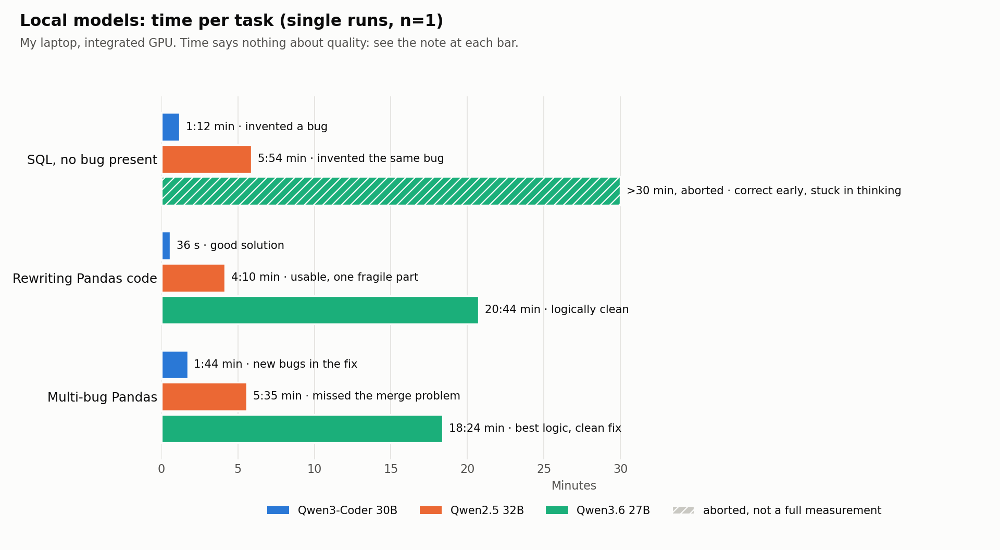

# Local AI Models: Tests, Timings and Results

**Back to the overview:** [How I Actually Use Local and Cloud AI](README.md) · **Deutsch:** [MODELLTESTS_DE.md](MODELLTESTS_DE.md)

> **Personal practice report – not a general AI benchmark**
> Tests as of: September 2026

The overview describes how I work with AI on my projects. This file contains the technical part: which local language models I tested with Ollama, with which tasks, how long they took, which mistakes they made, and which model I use for what today.

The results apply to **my machine, my models and my settings**. I did not carry out professional AI benchmarking. I wanted numbers so that I could make decisions.

---

## Table of Contents

- [1. My system](#1-my-system)
- [2. The environment had to be right first](#2-the-environment-had-to-be-right-first)
- [3. Ollama directly instead of Open WebUI](#3-ollama-directly-instead-of-open-webui)
- [4. Why local AI, and why not only local AI](#4-why-local-ai-and-why-not-only-local-ai)
- [5. How I tested](#5-how-i-tested)
- [6. Test: the query without a bug](#6-test-the-query-without-a-bug)
- [7. Test: many-to-many merge](#7-test-many-to-many-merge)
- [8. The measured timings](#8-the-measured-timings)
- [9. The models I tested](#9-the-models-i-tested)
- [10. Which model I use for what](#10-which-model-i-use-for-what)
- [11. What I learned from the comparison](#11-what-i-learned-from-the-comparison)
- [12. A good review prompt for a model](#12-a-good-review-prompt-for-a-model)
- [13. My local data-analysis workflow](#13-my-local-data-analysis-workflow)
- [14. A few basic Ollama commands](#14-a-few-basic-ollama-commands)

---

## 1. My system

| Component | My system |
|---|---|
| OS | EndeavourOS / Arch Linux |
| CPU | AMD Ryzen AI 9 HX 370, 12 cores / 24 threads |
| RAM | ca. 93 GiB usable |
| GPU | integrated AMD Radeon 890M (`gfx1150`) |
| GPU memory | shared memory |
| NVIDIA | none |
| Ollama | local model execution |
| Docker | for additional local services |
| Interface | terminal directly via Ollama; Open WebUI also tested |

The laptop has no dedicated graphics card. A model that takes 20 minutes on my machine can run completely differently on a strong dedicated GPU. When this file says "model X is slow", it always means:

> **Model X was slow at this task, on my system, with my configuration.**

---

## 2. The environment had to be right first

Part of the work was not about the models but about the environment.

**GPU.** My integrated AMD GPU was not being used meaningfully by Ollama at first. After enabling iGPU usage I could see with `ollama ps` that the models were actually running on the GPU. Without this check, you end up comparing different hardware paths and not the models.

**Context.** For one model, Open WebUI showed a context of `32768`, even though I wanted to work with smaller settings. A direct request to Ollama with `num_ctx=8192`, on the other hand, correctly ran with 8192.

That was one of the reasons I later ran the comparison tests **directly in the terminal**.

---

## 3. Ollama directly instead of Open WebUI

At first I tested a lot through Open WebUI. Some large models seemed almost unusably slow there: several minutes, sometimes timeouts.

Then I started the same models directly:

```bash
ollama run MODELNAME
```

The picture was sometimes completely different. Some models started responding immediately and wrote word by word. I can then see right away that something is happening.

That does **not** mean Open WebUI is bad. Possible reasons for the difference:

- longer system prompts,
- chat history,
- tools / function calling,
- extra context data,
- a larger context-window setting,
- my own configuration,
- things I have not optimally configured in Open WebUI yet.

I do not turn this into a general claim. For **my current way of working**, using Ollama directly is simpler, more transparent and faster. Open WebUI can still make sense when I need files, RAG, tools or a more comfortable interface. For pure model testing I want as few layers as possible between prompt and model.

---

## 4. Why local AI, and why not only local AI

### Privacy and habit

Not every file is strictly confidential. Still, I do not want to automatically send everything to an external service.

> If it can stay local, why should it leave my machine at all?

This is also about habit and data minimisation, not only about "highly sensitive" or "not sensitive".

**Local does not automatically mean allowed.** At a company, the internal rules for IT, privacy and compliance decide. If cloud AI is banned, that does not mean every local model is allowed. But I want to be technically able to work meaningfully without cloud AI.

### Cost and limits

Long work sessions produce a lot of messages: one SQL query, an error, a new version, a new error message, checking data, correcting text, adjusting a chart, checking again, reworking the README, back to the code.

If every small question goes to the cloud, a usage or API limit is burned through unnecessarily fast. A small syntax question or a normal email does not need to consume the strongest cloud AI. Local AI is therefore also a **load relief for the cloud**.

### Independence

There are environments where external AI may not be used or is temporarily unavailable. My workflow should not collapse the moment ChatGPT or another cloud service is missing. Local models do not need to be able to do everything. They need to be good enough that I can keep working.

### What cloud AI remains important for

- complex, multi-step tasks,
- a strong second or third check,
- current research on the web,
- working with many files,
- extensive formatting,
- finished documents and artifacts,
- difficult methodological discussions,
- longer-term project planning,
- cases where local models are not good enough in quality.

My goal is not a **local-only system**, but:

> **Use local wherever local works well. Use cloud where the extra quality or capability actually adds something.**

### What local AI does not replace

Documentation, source criticism, my own plausibility checks, web research, human judgment, an employer's data-protection rules, professional responsibility, and strong cloud models for genuinely difficult tasks.

Local AI is an additional layer in my toolbox. Nothing more, nothing less.

---

## 5. How I tested

I did not want to adopt online rankings. A model can be very good on a benchmark and still be annoying for my work. So I used tasks that I actually need.

### Language and everyday tests

- a short professional email in German,
- naturally correcting flawed English text,
- explaining an API in simple German,
- summarising four short bullet points,
- responding in normal everyday English without sounding like a teacher.

### Analysis test

I gave two hypothetical DeFi lending protocols with different borrow volume, different numbers of borrowers, different position sizes, liquidation volume and borrower concentration.

The model was supposed to:

- separate observation from interpretation,
- name alternative explanations,
- suggest additional metrics,
- identify problematic metrics,
- not invent causality.

### Coding and debugging tests

1. **Pandas duplicate weighting**
   A `transform("sum")` produces per-borrower totals across multiple transaction rows. The average of these repeated values is then incorrectly computed.

2. **Many-to-many merge / double counting**
   Multiple borrow rows and multiple liquidation rows for the same borrower are merged directly. This creates a cartesian product.

3. **SQL with no bug**
   One query was deliberately correct. The model was only supposed to report an error if one actually existed.

4. **Writing code from scratch**
   The model was supposed to build correct monthly metrics, including top-10 borrower share, from a simple DataFrame structure.

5. **Multiple simultaneous bugs**
   One test combined a merge explosion, incorrect `count`, wrong averaging level, and liquidation volume.

The task without a bug was especially helpful. It showed that models do not only miss real bugs; they also invent bugs.

---

## 6. Test: the query without a bug

The SQL query first aggregated on:

```text
month + protocol + borrower
```

Then it was grouped on:

```text
month + protocol
```

Each row of the CTE therefore already corresponds to exactly one unique borrower for that month and protocol. So

```sql
COUNT(*)
```

was completely correct.

**Result:**

- `qwen3-coder:30b` and `qwen2.5:32b` still claimed that `COUNT(*)` was wrong and had to be replaced with `COUNT(DISTINCT borrower)`. The new SQL would have produced the same value in this case, but the reasoning was wrong.
- `qwen3.6:27b` recognised fairly early that the query was correct. After that it kept thinking for a very long time and checked the same thing again and again.

> A model can deliver a "fix" that doesn't break the result, and still have misunderstood the logic.

**Being right, but spending 30 minutes thinking about whether something is right, is also not ideal in everyday use.**

---

## 7. Test: many-to-many merge

The example:

- Borrower `0x1` has two borrow rows.
- The same borrower has two liquidation rows.

A direct merge on

```python
["month", "protocol", "borrower"]
```

produces:

```text
2 borrows × 2 liquidations = 4 rows
```

This multiplies both the borrow values and the liquidation values.

**Result:**

- `qwen3-coder:30b` recognised the merge error, but then wrote an incomplete fix: it correctly aggregated only one side, which could still multiply values.
- `qwen2.5:32b` completely missed the central merge error in a later multi-bug test.
- `qwen3.6:27b` recognised the many-to-many join, the inflation of borrow volume, the inflation of liquidation volume, `count` instead of `nunique`, and the wrong averaging level.

`qwen3.6:27b` also proposed the clean solution:

1. Aggregate borrows separately.
2. Aggregate liquidations separately.
3. Only then join the aggregated tables.

That was the best answer in quality, but clearly slower.

---

## 8. The measured timings

These timings are **not standardized benchmarks**. They are single real runs on my system.

| Test | Model | Single run (n=1) | Result |
|---|---|---:|---|
| SQL "no bug present" | Qwen3-Coder 30B | ca. 1:12 min | fast, but invented a bug |
| SQL "no bug present" | Qwen2.5 32B | ca. 5:54 min | slower, invented the same bug |
| SQL "no bug present" | Qwen3.6 27B | >30 min, aborted | recognized early that the query was correct, but stayed stuck in thinking |
| Rewriting Pandas code | Qwen3-Coder 30B | ca. 36 s | good solution |
| Rewriting Pandas code | Qwen2.5 32B | ca. 4:10 min | usable, but one fragile part |
| Rewriting Pandas code | Qwen3.6 27B | ca. 20:44 min | logically clean, extremely slow |
| Multi-bug Pandas | Qwen3-Coder 30B | ca. 1:44 min | caught several real issues, but introduced new bugs in the fix |
| Multi-bug Pandas | Qwen2.5 32B | ca. 5:35 min | didn't recognize the central merge problem |
| Multi-bug Pandas | Qwen3.6 27B | ca. 18:24 min | best logic and clean fix |
| 4 language/everyday questions | Mistral Small 3.1 | ca. 3:38 min total | linguistically very good |



The chart shows the nine runs of the three coding tasks. The hatched bar was aborted after 30 minutes.

> **Speed, model size, and accuracy are three different things.**

---

## 9. The models I tested

### `mistral-small3.1`

**Tested for:** German email, English correction, everyday language, simple technical explanation.

**Strengths:** natural language, controlled corrections, friendly without being unnecessarily formal.

**Weakness:** not the absolute fastest small model on my system.

**Role:** **top candidate for everyday use, writing, language, and normal conversation.**

### `gemma2:9b-instruct`

**Strengths:** very fast, good short emails, good simple explanations, good natural English.

**Weaknesses:** issues with tools / function calling in Open WebUI; sometimes changes style more than desired.

**Role:** **very fast everyday and office model.**

### `qwen2.5:14b-instruct`

**Strengths:** fast, factual, good summaries, good email and explanation text.

**Weaknesses:** somewhat stiffer at times; overlaps heavily with other everyday models.

**Role:** **factual general/office model, possibly redundant later.**

### `gpt-oss:20b`

**Strengths:** good natural language, good corrections, pleasant all-rounder.

**Weaknesses:** on technical questions, several confidently stated errors or exaggerations, including on RAM/VRAM, Ollama/GPU, model sizes, and Ethereum history.

**Role:** **good generalist for language and everyday use, but I verify technical claims.**

### `llama3.1:8b-instruct`

**Strengths:** very fast, usable for simple questions, good simple English correction.

**Weaknesses:** weaker on technical precision; language sometimes a bit clunky.

**Role:** **very fast small fallback, but possibly redundant with Gemma.**

### `qwen2.5:32b`

**Strengths:** direct answers, good general analysis, noticeably nicer in the terminal than earlier in Open WebUI.

**Weaknesses:** often clearly slower than Qwen3-Coder in coding comparisons and not better; invented a bug in the correct SQL test; missed the most important structural error in the more complex Pandas test.

**Role:** **general larger analysis, not my primary coding model.**

### `qwen3-coder:30b`

**Strengths:** surprisingly fast on my system, good code drafts, Python and SQL, very practical for daily coding.

**Weaknesses:** not an automatic logic checker. It invented a bug in a correct SQL query, initially fixed a many-to-many bug incompletely, and in a later test even produced code that couldn't have worked as written.

**Role:** **my main model for writing code, quick Python/SQL help, and normal debugging.**

> **Code from the coder model is a draft, not an approval.**

### `qwen3.6:27b`

The most interesting model in the test.

**Strengths:** good methodical analysis, separates observation from interpretation better, finds alternative explanations, recognizes aggregation levels, was the strongest in quality on difficult Pandas/SQL logic tests.

**Weakness:** **thinking. A lot of thinking.** It can recognize a correct answer relatively early and then keep checking and repeating for minutes afterward. On some tasks, 18, 20, or over 30 minutes.

**Role:** **deep reviewer.** Not for every small question, but for important logic checks.

### `qwen3.5:27b`

Even run directly via Ollama, generation was very slow in my test. No clear advantage over my other models.

**Role:** **deletion candidate.**

### `deepcoder:14b`

Caught a subtle bug early in one Pandas test, but then got stuck in a very long thinking loop and practically never finished.

**Role:** **deletion candidate.**

### `qwen2.5-coder:7b`

**Advantage:** very fast.

**Problem:** didn't cleanly recognize the crucial duplicate-weighting logic and suggested a wrong fix.

**Role:** **deletion candidate.**

### `nomic-embed-text`

Not a chat model. Used for embeddings, semantic search, and local RAG.

**Role:** **keep.**

---

## 10. Which model I use for what

This is not a permanent truth. It is my state after these tests.

| Task | Model | Why |
|---|---|---|
| Everyday / writing / language, small email, English correction | **Mistral Small 3.1** (or Gemma 2 9B) | natural, controlled, good corrections |
| very fast everyday tasks, small Linux or everyday question | **Gemma 2 9B** (or Mistral, or whichever other small general-purpose model is loaded) | very fast and good enough |
| writing Python or SQL, normal debugging | **Qwen3-Coder 30B** | best mix of speed and coding usefulness |
| checking a weird aggregation or an important metric | **Qwen3.6 27B**, and if needed also cloud AI, documentation or my own mini test | strongest reviewer in quality in my tests |
| larger general analysis | **Qwen2.5 32B** or cloud AI | usable large generalist |
| RAG / semantic search over local data | **nomic-embed-text** + local LLM | different technical role |

Qwen2.5 14B, GPT-OSS 20B and Llama 3.1 8B can still be useful, but overlap more strongly with the roles above.

My clearest deletion candidates: `deepcoder:14b`, `qwen2.5-coder:7b`, `qwen3.5:27b`.

---

## 11. What I learned from the comparison

### Bigger isn't automatically better

A 32B model can be slower and make the same mistake as a 30B model. A smaller model can be more pleasant for a clear everyday task than a much bigger one.

### "Coder" doesn't mean "always logically correct"

A coding model can know syntax, libraries and structures very well and still build an incorrect aggregation. In data analysis this is especially dangerous, because the code still runs without errors.

### Code that runs isn't automatically correct code

A query can compile, run and produce a nice-looking table and still be methodologically wrong.

### Negative tests matter

Do not only ask: "Can you find the bug?" Sometimes deliberately give correct code and ask: "Is there a **confirmed** bug?" That shows whether the model is actually checking, or inventing a bug because the prompt sounds like it is asking for one.

### More thinking isn't automatically more truth

Qwen3.6 showed that long thinking phases can produce very good results. It also showed that a model can repeat the same correct reasoning for a very long time.

> **Thinking is not a quality certificate.**

### Streaming changes usability a lot

A model that starts responding immediately and keeps writing slowly is often more pleasant for me than one that appears to do nothing for five minutes and then delivers everything at once.

### Multiple models can share the same reasoning error

Qwen3-Coder and Qwen2.5 32B reached practically the same wrong conclusion on the `COUNT(*)` test. "Ask a second model" is therefore good, but no guarantee of independent verification. Sometimes what you need instead of a second model is math, small test data, documentation, or checking it yourself.

> **If three models make the same mistake, the mistake doesn't become correct by democracy.**

I know this from my history studies: even when many sources, or many historians, share the same wrong claim, that does not make it true.

### Why I still enjoy reading the thinking output

I enjoy reading a model's thinking output, even when it takes half an hour for a simple question or a code correction. You learn a lot from it. You see:

- contradictions in the model's own reasoning,
- doubts that no longer show up in the final answer,
- how the model actually thinks and what logic is behind it,
- how dangerous it would be to just take these intermediate steps as facts.

For me this is not only true for technical questions. Especially with very general questions, I find the reasoning very interesting: you get a glimpse of how developers think, and you notice where large companies or states might be pushing certain narratives or trying to shift values.

My recommendation: read the thinking output when a model shows it. It helps you understand how a model actually works, and maybe also helps you not to believe everything an AI says.

---

## 12. A good review prompt for a model

Instead of just:

```text
Is this code correct?
```

better:

```text
Goal:
- total borrow volume
- unique borrowers
- average total borrowed amount per borrower

Identify only confirmed logic errors.
Do not invent problems.
Explain the aggregation level.
Give corrected code only if needed.
```

Even better is a small test table where I already know the correct result in advance. Then I am not testing whether the model explains nicely, but whether it is right.

---

## 13. My local data-analysis workflow

I have built a general local workflow that separates calculation and interpretation:

- load and clean CSV → Pandas
- data types / missing values / duplicates → Pandas
- statistics and correlations → Pandas
- first charts → Matplotlib
- structural questions → local RAG
- interpretation → local Ollama model
- safe natural-language calculation questions → predefined Pandas operations
- code suggestions → local code model
- AI-generated code → **not executed automatically**

For simple natural-language calculation questions, the model only produces a small structured plan. The notebook checks this plan and only executes permitted Pandas operations.

I like this much better than:

```text
User asks something
→ LLM writes arbitrary Python code
→ code gets executed automatically
→ hope everything is correct
```

My goal is not maximum "agent magic", but a workflow I can understand and control.

### What does not work yet

This workflow is not finished. Right now, using individual models directly through WebUI or the terminal often gives me better results than my own automated pipeline does. The intended flow (the model produces a small structured plan, the notebook only executes permitted Pandas operations) is not reliable enough yet.

I worked very intensively on this pipeline for days. At some point a classic 80/20 situation showed up: the last percentage of automation would have cost many more hours, which I now prefer to invest elsewhere. So I only work on it occasionally.

What stayed is not the finished automation but the method behind it: deliberately using different models for different tasks and checking the results myself. I see this as an experimentation environment, not a finished AI system.

### Possible next steps

- retest models after updates,
- save more reproducible benchmarks with identical prompts,
- compare context length and quantization more systematically,
- log RAM/GPU utilization,
- configure Open WebUI more cleanly and retest it against running Ollama directly,
- build automated test cases with known correct results,
- organize local models more by role rather than by "one best model".

---

## 14. A few basic Ollama commands

Start a model:

```bash
ollama run qwen3-coder:30b
```

Leave a session:

```text
/bye
```

Check loaded models / execution:

```bash
ollama ps
```

Installed models:

```bash
ollama list
```

Stop a model and free up memory:

```bash
ollama stop qwen3.6:27b
```

Ask a single question directly, without switching into chat mode:

```bash
ollama run gemma2:9b "What is a DataFrame? Explain it briefly."
```

Save the answer straight to a file:

```bash
ollama run mistral-small3.1:latest "Write a short summary about Berlin." > berlin.txt
```

Read the file:

```bash
cat berlin.txt
```

See the answer and save it at the same time:

```bash
ollama run mistral-small3.1:latest "Explain briefly what SQL is." | tee sql.txt
```

Hand a code or text file to the AI:

```bash
cat analysis.py | ollama run qwen3-coder:30b "Check this Python code for confirmed bugs."
```

Save a code review straight to a file:

```bash
cat analysis.py | ollama run qwen3-coder:30b "Check the code and explain the bugs." > code_review.txt
```

For me, `ollama ps` was especially useful for seeing which model is loaded, what context it is using, and whether it is running on GPU or CPU.

---

## Rights

© 2026 Amirhoushang Rahmannejad. All rights reserved. You are welcome to read and review this project. Copying, modifying or redistributing it requires my written permission.
